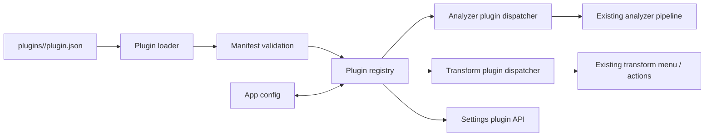

# Plugin / Extension System Design

## Summary

Build a v1 plugin platform for Smart Clipboard that can discover local plugins from a `plugins/` directory, validate their manifests, persist enabled/disabled state in app configuration, register them in a runtime registry, and expose a limited `content_processor` capability to the existing analyzer and transform flows. The first version will not execute arbitrary third-party code. Instead, plugin manifests bind to trusted built-in handlers, which gives us a safe and testable extension model while establishing the long-term plugin architecture.

## Goals

- Add a stable plugin manifest format and plugin discovery flow.
- Add a runtime registry that tracks installed plugins, validation state, capabilities, and enabled state.
- Persist plugin enabled/disabled state in the existing configuration system.
- Extend the content-processing pipeline so plugins can contribute classification results and transform actions.
- Add settings UI for inspecting plugin status and toggling enabled state.
- Ship one example content-processing plugin that validates the full end-to-end path.

## Non-Goals

- No remote plugin marketplace or online install flow.
- No arbitrary JavaScript or Rust third-party code execution.
- No hot reload or filesystem watch.
- No advanced UI extension points such as custom panels or commands.
- No sync/data-source plugin support in v1.
- No per-plugin permission prompts beyond static manifest-declared capabilities.

## Product Scope

### User-visible behavior

- The app scans a local `plugins/` directory during startup.
- Valid plugins appear in settings with metadata, capability summary, current status, and enable toggle.
- Invalid plugins do not break startup; they are listed with error details.
- Enabled content-processor plugins can add classification candidates and transform actions.
- Disabled plugins remain installed and visible, but their hooks do not run.

### First supported plugin kind

Only `content_processor` plugins are supported in v1.

### First supported execution model

Plugins do not execute arbitrary code. Each plugin manifest references a trusted built-in handler identifier that is implemented inside the application. The manifest defines metadata and declares which built-in handler to attach to.

## Architecture



## Design Decisions

### 1. Plugin storage layout

Plugins live under a top-level application data `plugins/` directory. Each plugin gets its own folder:

```text
plugins/
  markdown-tools/
    plugin.json
```

For development and tests, the loader can also be pointed to a temporary directory so the plugin system is testable without relying on a real user data path.

### 2. Manifest schema

Each plugin includes `plugin.json` with the following fields:

```json
{
  "id": "markdown-tools",
  "name": "Markdown Tools",
  "version": "1.0.0",
  "kind": "content_processor",
  "enabledByDefault": true,
  "description": "Adds markdown-aware classification and transforms.",
  "capabilities": ["classify", "transform"],
  "handler": "builtin.markdown_tools"
}
```

#### Field semantics

- `id`: stable machine-readable plugin id, unique across installed plugins.
- `name`: human-readable name for settings UI.
- `version`: semantic version string for display and future compatibility checks.
- `kind`: currently must be `content_processor`.
- `enabledByDefault`: default enabled state when no explicit persisted preference exists.
- `description`: optional user-facing explanation.
- `capabilities`: declared hooks. For v1 only `classify` and `transform` are valid.
- `handler`: built-in handler identifier implemented by the app.

#### Validation rules

- Missing required fields → invalid plugin.
- Unsupported `kind` → invalid plugin.
- Unknown capability → invalid plugin.
- Unknown `handler` → plugin is loaded as invalid and surfaced in settings.
- Duplicate `id` → keep the first valid plugin discovered, mark subsequent duplicates invalid with duplicate-id error.

### 3. Runtime model

Add a backend plugin subsystem with these primary types:

- `PluginManifest`
- `PluginStatus` (`valid`, `invalid`, `disabled` is derived from persisted state + validity)
- `PluginLoadError`
- `InstalledPlugin`
- `PluginRegistry`
- `BuiltinPluginHandlerRegistry`

`InstalledPlugin` stores:

- manifest
- plugin directory path
- validation result
- resolved enabled state

`PluginRegistry` is the single source of truth used by commands, analyzer dispatch, and transform dispatch.

### 4. Config persistence

Plugin enablement state is persisted in the existing app configuration. Add a new config section keyed by plugin id, for example:

```json
{
  "plugins": {
    "markdown-tools": {
      "enabled": true
    }
  }
}
```

Resolution order:

1. If config contains explicit state for plugin id, use it.
2. Otherwise fall back to manifest `enabledByDefault`.

If a plugin disappears from disk, its persisted config entry may remain and is ignored until a plugin with the same id is installed again.

### 5. Built-in handler abstraction

To avoid arbitrary third-party code execution, create a built-in handler registry in Rust. Each handler implements a stable trait-like contract for `content_processor` plugins.

Suggested capabilities:

- `classify(&str) -> Option<PluginClassification>`
- `list_transforms(&str) -> Vec<PluginTransformAction>`
- `apply_transform(&str, transform_id: &str) -> Result<String, PluginError>`

The plugin manifest only chooses which built-in handler is used. This creates a safe architecture now and preserves a clean separation between plugin metadata and behavior.

### 6. Analyzer integration

Current analyzer behavior remains authoritative for existing built-in categories. Plugin classification is additive.

Rule for v1:

- Run existing analyzer first.
- Then run enabled plugin `classify` hooks.
- Plugin results are surfaced as supplemental metadata rather than replacing the primary built-in content type.

This avoids destabilizing existing search/filter behavior while still proving that plugins can enrich the pipeline.

Suggested return shape:

- primary built-in content type remains unchanged.
- optional `pluginClassifications: string[]` is attached to the analysis result or entry metadata returned to the frontend.

### 7. Transform integration

Extend the transform flow so enabled plugins can contribute transform actions for a given text content.

Rule for v1:

- Existing built-in transforms continue to render as today.
- Plugin-provided transforms are appended in a separate grouped section labeled by plugin name.
- Triggering a plugin transform calls a new backend command that dispatches to the resolved handler.

This provides the clearest visible proof of plugin functionality with minimal disruption.

### 8. Settings UI

Add a plugin management section to `SettingsPanel`.

For each discovered plugin show:

- name
- id
- version
- description
- kind
- capability list
- handler id
- enabled toggle if valid
- invalid/error status if not valid

User actions in v1:

- toggle enabled/disabled for valid plugins
- refresh plugin list manually if needed during session (optional but recommended if low cost)

If manual refresh is included, it rescans the plugin directory and rehydrates the registry without restart. If not included, copy should clearly say plugins are loaded on app start. Recommended choice: omit manual refresh from v1 unless implementation is nearly free.

### 9. Example plugin

Ship one example plugin folder:

- `plugins/markdown-tools/plugin.json`

Bind it to handler `builtin.markdown_tools`.

#### Example behavior

Classification:

- fenced code block → `markdown_code_block`
- checklist → `markdown_checklist`
- markdown table → `markdown_table`

Transforms:

- `markdown_to_blockquote`: prefix each non-empty line with `> `
- `strip_markdown_format`: remove a conservative subset of markdown markers (headings, emphasis markers, checklist markers, fenced code fences)

The transform implementation should stay deliberately conservative and deterministic so tests are clear and behavior is easy to trust.

### 10. Error handling

- Manifest parse failure: plugin listed as invalid with parse error.
- Validation failure: plugin listed as invalid with specific reason.
- Handler lookup failure: plugin listed as invalid.
- Hook execution failure: do not fail the overall analyzer/transform pipeline; return an operation error scoped to that plugin invocation.
- Settings query command must always succeed even if some plugins are invalid.

### 11. Testing strategy

#### Rust unit tests

- manifest parsing success/failure
- validation rules
- duplicate plugin id handling
- config enablement resolution
- built-in handler registry lookup
- plugin classify dispatch
- plugin transform dispatch

#### Rust integration-style tests

- scan temporary plugin directory and load registry
- invalid plugin does not break valid plugin loading
- toggling plugin persisted in config affects dispatch results

#### Frontend tests

- settings plugin list renders metadata and invalid state
- valid plugin toggle calls store action / command
- transform menu renders plugin section and actions

#### Verification target

A user can install the example plugin locally, restart the app, see it in settings, disable/enable it, and observe markdown-specific transform actions appear or disappear accordingly.

## File / Module Plan Direction

Expected backend additions:

- new `src-tauri/src/plugins/` module for manifest, loader, registry, built-in handlers, commands
- `config.rs` updates for plugin state persistence
- `commands.rs` updates for plugin settings / transform dispatch API
- analyzer integration touchpoint
- transform command touchpoint

Expected frontend additions:

- plugin types in `src/types/`
- plugin store or settings-local state in `src/stores/`
- `SettingsPanel.vue` plugin management UI
- `TransformMenu.vue` plugin transform rendering and action wiring

Expected assets:

- top-level `plugins/markdown-tools/plugin.json`

## Trade-offs

### Why not arbitrary JavaScript execution now?

Because it would force us to solve sandboxing, permissions, trust model, runtime lifecycle, and cross-platform execution semantics all at once. That is too much risk for v1.

### Why keep built-in analyzer result as primary?

Because current app features such as filtering and search already depend on the built-in content typing model. Supplemental plugin classifications let us prove extensibility without regressing existing behavior.

### Why persist enablement in config?

Because a plugin system without durable enablement is not operationally useful. Persisted state is a small amount of extra work with high user value.

## Open Questions Resolved

- Execution model: built-in trusted handlers only for v1.
- First plugin kind: `content_processor` only.
- Enablement persistence: stored in config.
- UI scope: settings management + transform menu integration, no custom plugin UI.

## Success Criteria

- App startup scans local plugins without crashing on invalid manifests.
- Valid plugins appear in settings and can be enabled/disabled persistently.
- Enabled example plugin contributes markdown transform actions end-to-end.
- Disabled example plugin contributes no actions.
- Test suite covers manifest loading, registry behavior, persistence, and UI rendering.
